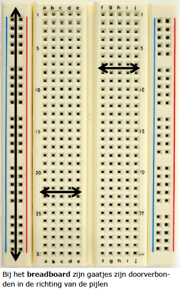
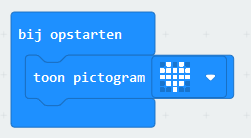
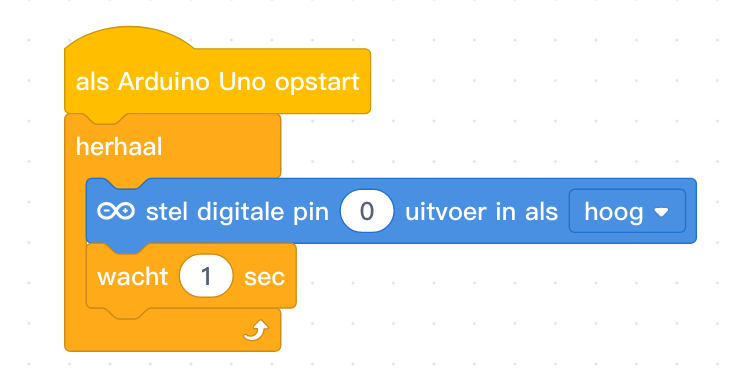
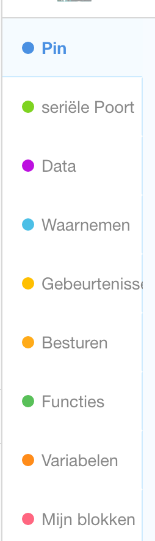
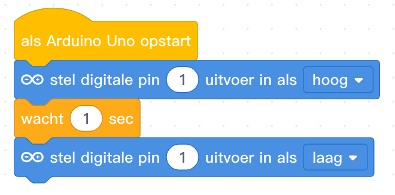
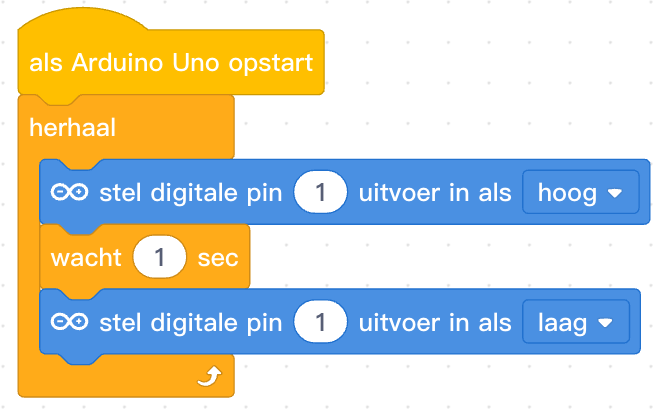

## Inhoud

- [Introductie](#introductie)
- [Scratch](#scratch)
- [Elektronica voor verkeerslicht](#elektronica-voor-verkeerslicht)
- [Breadboard](#breadboard)
  - [LED](#led)
  - [Knopje](#knopje)
  - [Fotocel](#fotocel)
- [micro:bit visueel](#microbit-visueel)
  - [De verbinding testen](#de-verbinding-testen)
- [micro:bit Python code](#microbit-python-code)
- [Arduino visueel](#arduino-visueel)
- [Arduino code](#arduino-code)

## Introductie

Bij deze CoderDojo gaan we verkeerslichten maken. Dat kan met:

- Scratch
- micro:bit
  - visueel programmeren (lijkt op Scratch)
  - in Python
- Arduino
  - visueel programmeren (met mBlock, gebaseerd op Scratch)
  - in de Arduino programmeertaal

Als je met de micro:bit of Arduino aan de slag gaat moet je zelf een circuitje bouwen. Daarvoor hebben we natuurlijk gekleurde LEDjes, en daarnaast ook knopjes en fotocellen waarmee je je verkeerslicht verder kunt uitbreiden.

## Scratch

- Ontwerp een verkeerlicht-sprite
- Laat het licht om de zoveel tijd van kleur veranderen
- Voeg een sprite toe die het verkeerslicht op rood/groen kan laten springen

## Elektronica voor verkeerslicht

## Breadboard

Je kunt een circuit bouwen op een zogenaamd breadboard. Deze zijn er in allerlei soorten en maten. Op dit schema kun je zien welke gaatjes (elektrisch) met elkaar verbonden zijn.

### LED

Net als batterijen hebben LED lampjes een plus en een min. Als je goed kijkt zijn de pootjes van de LED's niet even lang: het net iets langere pootje is de plus, de kortere de min.

### Knopje

### Fotocel

### Circuit met led

Een voorbeeld van een circuit met led.

## micro:bit visueel

- Gebruik bij voorkeur de [Google Chrome webbrowser](https://www.google.nl/chrome/)
- Ga naar [de Makecode editor](makecode.microbit.org)
- Stel de taal in op Nederlands

### De verbinding testen

- Sluit de micro:bit met de USB kabel aan op de computer
- Maak een eerste programma: toon het hart-pictogram
  
- Download nu het programma naar de micro:bit
  - In Chrome: WebUSB -> tandwiel -> apparaat koppelen -> Downloaden
  - Andere browsers:
    - Downloaden -> doel kiezen: "MICROBIT"
    - Als standaardmap voor Downloads ingesteld: kopieer/verplaats vanaf daar

### Een LED laten knipperen

### Meer LEDs aansluiten

### Timing van de LEDs

### De micro:bit knoppen gebruiken

### De micro:bit lichtsensor gebruiken

## micro:bit Python code

- Keuze tussen https://python.microbit.org/v/1.1 en Mu editor?
- Maak een eerste programma:
-

## Arduino visueel

Om een arduino visueel te programmeren kunnen we gebruik maken van de mblock5 editor (http://www.mblock.cc/mblock-software/).

Om een verkeerslicht te simuleren beginnen we met 1 led lampje en een arduino. Vervolgens kun je zelf aan de slag om een verkeerslicht in elkaar te zetten.

<h3>1 Led laten knipperen</h3>

<ol>
  <li>
    Maak het volgende circuit (met behulp van een breadboard).  
  </li>

  <li>
    Schakel nu de LED in door de juiste output op <b><i>HOOG</i></b> te zetten.
  </li>
  

    
mBlock code

    
  

  <li>
    Nu wil je dat de LED daarna ook weer uit gaat.
    

      
mBlock code

    
    

  </li>

  <li>
    Er zit geen tijd tussen het aan- en uitgaan!
    

      
mBlock code

    
    

  </li>

  <li>
    Nu wil je dit blijven herhalen.
    

      
mBlock code

    
    

  </li>
  <li>Nu hebben we 1 led, kun jij een stoplicht maken?</li>
</ol>

# Arduino code
