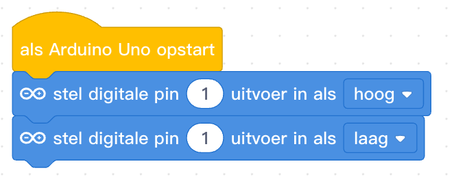

## Inhoud

- [Introductie](#introductie)
- [Scratch](#scratch)
- [Elektronica voor verkeerslicht](#elektronica-voor-verkeerslicht)
- [Breadboard](#breadboard)
  - [LED](#led)
  - [Knopje](#knopje)
  - [Fotocel](#fotocel)
- [micro:bit visueel](#microbit-visueel)
  - [De verbinding testen](#de-verbinding-testen)
- [micro:bit Python code](#microbit-python-code)
- [Arduino visueel](#arduino-visueel)
- [Arduino code](#arduino-code)

## Introductie

Bij deze CoderDojo gaan we verkeerslichten maken. Dat kan met:

- Scratch
- micro:bit
  - visueel programmeren (lijkt op Scratch)
  - in Python
- Arduino
  - visueel programmeren (met mBlock, gebaseerd op Scratch)
  - in de Arduino programmeertaal

Als je met de micro:bit of Arduino aan de slag gaat moet je zelf een circuitje bouwen. Daarvoor hebben we natuurlijk gekleurde LEDjes, en daarnaast ook knopjes en fotocellen waarmee je je verkeerslicht verder kunt uitbreiden.

## Scratch

- Ontwerp een verkeerlicht-sprite
- Laat het licht om de zoveel tijd van kleur veranderen
- Voeg een sprite toe die het verkeerslicht op rood/groen kan laten springen

## Elektronica voor verkeerslicht

## Breadboard

Je kunt een circuit bouwen op een zogenaamd breadboard. Deze zijn er in allerlei soorten en maten. Op dit schema kun je zien welke gaatjes (elektrisch) met elkaar verbonden zijn.


### LED

Net als batterijen hebben LED lampjes een plus en een min. Als je goed kijkt zijn de pootjes van de LED's niet even lang: het net iets langere pootje is de plus, de kortere de min.

### Knopje

### Fotocel

### Circuit met led

Een voorbeeld van een circuit met led.

## micro:bit visueel

- Gebruik bij voorkeur de [Google Chrome webbrowser](https://www.google.nl/chrome/)
- Ga naar [de Makecode editor](makecode.microbit.org)
- Stel de taal in op Nederlands

### De verbinding testen

- Sluit de micro:bit met de USB kabel aan op de computer
- Maak een eerste programma: toon het hart-pictogram
  
- Download nu het programma naar de micro:bit
  - In Chrome: WebUSB -> tandwiel -> apparaat koppelen -> Downloaden
  - Andere browsers:
    - Downloaden -> doel kiezen: "MICROBIT"
    - Als standaardmap voor Downloads ingesteld: kopieer/verplaats vanaf daar

### Een LED laten knipperen

### Meer LEDs aansluiten

### Timing van de LEDs

### De micro:bit knoppen gebruiken

### De micro:bit lichtsensor gebruiken

## micro:bit Python code

- Keuze tussen https://python.microbit.org/v/1.1 en Mu editor?
- Maak een eerste programma:
-

## Arduino visueel

Om een arduino visueel te programmeren kunnen we gebruik maken van de mblock5 editor (http://www.mblock.cc/mblock-software/).

Om een verkeerslicht te simuleren beginnen we met 1 led lampje en een arduino. Vervolgens kun je zelf aan de slag om een verkeerslicht in elkaar te zetten.

### Een led laten knipperen

<ol>
  <li>
    Maak het volgende circuit (met behulp van een breadboard). <br />
  </li>

  <li>
    Schakel nu de LED in door de juiste output op <b><i>HOOG</i></b> te zetten.
  </li>
  <details>
    <summary>mBlock code</summary>
    
  </details>
  <li>
    Nu wil je dat de LED daarna ook weer uit gaat.
    <details>
      <summary>mBlock code</summary>
    
    </details>
  </li>

  <li>
    Er zit geen tijd tussen het aan- en uitgaan!
    <details>
      <summary>mBlock code</summary>
    
    </details>
  </li>

  <li>
    Nu wil je dit blijven herhalen.
    <details>
      <summary>mBlock code</summary>
    
    </details>
  </li>
  <li>Nu hebben we 1 led, kun jij een stoplicht maken?</li>
</ol>

### Een led laten knipperen door een licht sensor

<ol>
  <li>
    Maak het volgende circuit (met behulp van een breadboard). <br />
  </li>

  <li>
    We kunnen nu de waarde van deze licht sensor uitlezen met het blok:
    

Let wel op: dit blok moet gecombineerd worden met een functie. Bijvoorbeeld 'groter dan' of 'kleiner dan'.

  

Kun jij nu met de licht sensor een led aan of uit zetten?

  <details>
    <summary>mBlock code</summary>
    
  </details>
  </li>
  <li>Nu hebben we 1 led, kun jij een stoplicht maken met 3 ledjes en 3 licht sensoren?</li>
</ol>

# Arduino code

## Intro Arduino

Als we met Arduino een programma schrijven dan hebben we altijd 2 'functies' die we altijd gebruiken, Arduino roept deze voor ons aan.

De functies zijn als volgt:

```Arduino
//Deze functie wordt aangeroepen zodra de arduino opstart,
//dit gebeurt dan ook maar 1 keer.
void setup() {

}

//Zodra de setup() functie is afgerond,
//wordt de loop() functie constant aangeroepen.
void loop() {

}
```

Het is dan ook verstandig om in de `void setup()` functie alle instellingen voor het programma uit te voeren.

Vervolgens kunnen we logica, zoals een led aan of uit zetten, in de `void loop()` functie zetten.

<details>
    <summary>Handige Arduino functies</summary>

```Arduino
//Deze functie zorgt ervoor dat een pin op de Arduino als output kan functioneren.
pinMode(pinNummer, OUTPUT);

//Deze functie zorgt ervoor dat een pin op de Arduino als input kan functioneren.
pinMode(pinNummer, INPUT);

//Deze functie stuurt een HOOG signaal naar een pin
digitalWrite(pin, HIGH);

//Deze functie stuurt een LAAG signaal naar een pin
digitalWrite(pin, LOW);

//Deze functie leest een analoge waarde van een analoge pin uit.
analogRead(pin);
//Deze functie kan zo gebruikt worden:
int value = analogRead(pin);

//Deze functie laat het programma een aantal milliseconden wachten:
delay(milliseconden)
```

  </details>
  
## Programmeren Arduino

<ol>
  <li>
    Maak het volgende circuit (met behulp van een breadboard). <br />
  </li>

We gaan een led programmeren, hiervoor moeten we eerst een aantal instellingen goed zetten. We gaan bijvoorbeeld een pin hoog of laag aansturen. Dit betekent dat de arduino dus een signaal output.

Weet jij nog hoe we een arduino pin kunnen configureren als `output`?

Vergeet niet dat we instellingen in de `void setup()` functie plaatsen, zodat deze maar een keer uitgevoerd worden.

  <details>
    <summary>Arduino code</summary>

```Arduino

int groeneLedPin = 0;

void setup() {
  pinMode(groeneLedPin, OUTPUT);
}

void loop() {

}

```

  </details>
<li>
 
 Nu hebben we een pin als output gedefinieert, kun jij hier een `HOOG` signaal naar toe sturen?

  <details>
    <summary>Arduino code</summary>

```Arduino

int groeneLedPin = 0;

void setup() {
  pinMode(groeneLedPin, OUTPUT);
}

void loop() {
  digitalWrite(groeneLedPin, HIGH);
}

```

  </details>
</li>

<li>

Het ledje staat nu aan, kun jij het uit zetten?

  <details>
    <summary>Arduino code</summary>

```Arduino

int groeneLedPin = 0;

void setup() {
  pinMode(groeneLedPin, OUTPUT);
}

void loop() {
  digitalWrite(groeneLedPin, LOW);
}

```

  </details>

</li>

<li>

En heb je een idee hoe we het ledje kunnen laten knipperen?

  <details>
    <summary>Arduino code</summary>

```Arduino

int groeneLedPin = 0;

void setup() {
  pinMode(groeneLedPin, OUTPUT);
}

void loop() {
  digitalWrite(groeneLedPin, LOW);
  delay(1000); //1 seconde
  digitalWrite(groeneLedPin, HIGH);
  delay(1000); //1 seconde
}

```

  </details>

</li>

</ol>

Nu hebben we 1 led, kun jij een stoplicht maken met 3 ledjes ?

### Een led laten knipperen door een licht sensor

<ol>
  <li>
    Maak het volgende circuit (met behulp van een breadboard). <br />
  </li>

  <li>
    We kunnen nu de waarde van deze licht sensor uitlezen met de functie:

```Arduino
//Geeft een getal terug tussen de 0 en 1023. (int)
analogRead(pin);
//Sla de waarde op in 'gelezenWaarde'
int gelezenWaarde = analogRead(pin);
```

</li>

<li>
  
  We voegen nu een `input` toe aan ons systeem, weet jij nog hoe we dit instellen?

  <details>
    <summary>Arduin Code</summary>

```Arduino
int groeneLedPin = 0;
int lichtSensorPin = 1;

void setup() {
  pinMode(groeneLedPin, OUTPUT);
  pinMode(lichtSensorPin, INPUT);
}

void loop() {

}
```

  </details>

</li>

<li>

Als de waarde van de lichtsensor nu hoger is dan bijvoorbeeld 500, kun jij dan de led uitzetten?

  <details>
    <summary>Code </summary>

```Arduino
int groeneLedPin = 0;
int lichtSensorPin = 1;

void setup() {
  pinMode(groeneLedPin, OUTPUT);
  pinMode(lichtSensorPin, INPUT);
}

void loop() {
  int gelezenWaarde = analogRead(lichtSensorPin);

  if (gelezenWaarde > 500)
  {
    digitalWrite(groeneLedPin, HIGH);
  }
  else
  {
    digitalWrite(groeneLedPin, LOW);
  }
}
```

  </details>
  </li>
  <li>Nu hebben we 1 led, kun jij een stoplicht maken met 3 ledjes en 3 licht sensoren?</li>
</ol>
