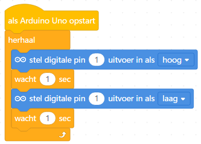

## Inhoud

- [Introductie](#introductie)
- [Scratch](#scratch)
- [Elektronica voor verkeerslicht](#elektronica-voor-verkeerslicht)
  - [Breadboard](#breadboard)
  - [LED](#led)
  - [Knopje](#knopje)
  - [Fotocel](#fotocel)
- [micro:bit](#microbit)
  - [micro:bit visueel](#microbit-visueel)
  - [micro:bit Python code](#microbit-python-code)
- [Arduino](#arduino)
  - [Arduino visueel](#arduino-visueel)
  - [Arduino code](#arduino-code)

## Introductie

Bij deze CoderDojo gaan we verkeerslichten maken. Dat kan met:

- Scratch
- micro:bit
  - visueel programmeren (lijkt op Scratch)
  - in Python
- Arduino
  - visueel programmeren (met mBlock, gebaseerd op Scratch)
  - in de Arduino programmeertaal

Als je met de micro:bit of Arduino aan de slag gaat moet je zelf een circuitje bouwen. Daarvoor hebben we natuurlijk gekleurde LEDjes, en daarnaast ook knopjes en fotocellen waarmee je je verkeerslicht verder kunt uitbreiden.

## Scratch

- Ontwerp een verkeerlicht-sprite
- Laat het licht om de zoveel tijd van kleur veranderen
- Voeg een sprite toe die het verkeerslicht op rood/groen kan laten springen

## Elektronica voor verkeerslicht

### Breadboard

Je kunt een circuit bouwen op een zogenaamd breadboard. Deze zijn er in allerlei soorten en maten. Op dit schema kun je zien welke gaatjes (elektrisch) met elkaar verbonden zijn.


### LED

Net als batterijen hebben LED lampjes een plus en een min. Als je goed kijkt zijn de pootjes van de LED's niet even lang: het net iets langere pootje is de plus, de kortere de min.


### Weerstand

Een weerstand zet een deel van de stroom die er doorheen loopt om in warmte. Hiermee kun je bijvoorbeeld andere onderdelen in je circuit, bijvoorbeeld een LED, beschermen tegen te hoge spanningen. 


### Fotocel

Een fotocel is een soort weerstand, met de speciale eigenschap dat de sterkte van de weerstand afhangt van hoeveel licht er op de fotocel valt. Deze hoeveelheid licht kun je meten met zowel de micro:bit als de Arduino. 


# micro:bit

## micro:bit visueel

- Gebruik bij voorkeur de [Google Chrome webbrowser](https://www.google.nl/chrome/), dit maakt het downloaden van programma's naar de micro:bit een stuk eenvoudiger.
- Ga naar [de Makecode editor](makecode.microbit.org)
- Stel de taal in op Nederlands

### De verbinding testen

- Sluit de micro:bit met de USB kabel aan op de computer
- Maak een eerste programma: toon het hart-pictogram
  
  
- Upload nu het programma naar de micro:bit
  - In Chrome kan dit via "WebUSB". Klik hiervoor eerst op het tandwiel rechtsboven -> Apparaat koppelen (2x) -> selecteer de micro:bit en klik op Verbinding maken. Als je nu op Downloaden klikt wordt de code meteen op de micro:bit gezet.
  - In andere browsers:
    - Klik op Downloaden en kies als doel de schijf "MICROBIT"
    - Als er geen doel opgegeven kan worden is er een standaardmap voor downloads ingesteld; kopieer in dat geval het bestand vanaf die map naar de schijf "MICROBIT"

### Een LED laten knipperen

<ol>
  <li>
    Maak het volgende circuit (met behulp van een breadboard).<br /><br />
    <br /><br />
    Als je geen DragonTail hebt kun je dit schema maken, je hebt dan ook een paar krokodillenbekken nodig.<br /><br />
    
  </li>
  <li>
    Schakel nu de LED in door de juiste output (pin) op <b><i>1</i></b> te zetten.
  </li>
  <details>
    <summary>micro:bit code</summary>
    
  </details>
  <li>
    Nu wil je dat de LED daarna ook weer uit gaat.
    <details>
      <summary>micro:bit code</summary>
    
    </details>
  </li>

  <li>
    Er zit geen tijd tussen het aan- en uitgaan!
    <details>
      <summary>micro:bit code</summary>
    
    </details>
  </li>

  <li>
    Nu wil je dit blijven herhalen.
    <details>
      <summary>micro:bit code</summary>
    
    </details>
  </li>
  <li>Nu hebben we 1 LED, kun jij het verkeerslicht afmaken?</li>
</ol>

### De micro:bit knoppen gebruiken

  Veel verkeerslichten reageren op de omgeving, bijvoorbeeld wanneer een auto tot de streep rijdt of een fietser op een knop drukt. Gebruik nu de micro:bit knoppen om het verkeerslicht op groen (of juist op rood) te laten springen. Je kunt hiervoor een `als ... dan ...` blok voor gebruiken.
  <details>
    <summary>micro:bit code</summary>
    
  </details>

### De micro:bit lichtsensor gebruiken

De LEDs voor op de micro:bit werken als een soort lichtsensor. Door de `lichtniveau` variabele te gebruiken kun je het verkeerslicht laten reageren op de hoeveelheid licht in de omgeving. Probeer bijvoorbeeld door je hand op de micro:bit te leggen het verkeerslicht op groen te laten springen. Je hebt hiervoor een vergelijking nodig, die vind je in het menu `Logisch`.

<details>
  <summary>micro:bit code</summary>
  
</details>

### De fotocel als lichtsensor gebruiken

Je kunt ook een aparte fotocel als lichtsensor gebruiken. Deze moet je aansluiten op <b><i>pin 0, 1 of 2</b></i>. Let op: Als je verkeerslicht 3 LEDs heeft moet je een van die LEDs aansluiten op <b><i>pin 8, 12 of 16</b></i>.

De fotocel sluit je als volgt aan (in dit voorbeeld op pin 2):

  

Net als in het vorige voorbeeld heb je een vergelijking nodig, dit keer alleen niet met `lichtniveau` maar met de waarde van de pin waar je de sensor op hebt aangesloten.
<details>
  <summary>micro:bit code</summary>
  
</details>


## micro:bit Python code

Je kunt op meerdere manieren Python code voor de micro:bit schrijven:
- online op https://python.microbit.org/v/1.1
- met [Mu](https://codewith.mu/)

Het voordeel van Mu is dat je code rechtstreeks naar de micro:bit wordt geschreven.

Een overzicht van alle Python functies voor micro:bit vind je [hier](https://microbit-micropython.readthedocs.io/en/latest/index.html).

### Een LED laten knipperen

<ol>
  <li>
    Maak het volgende circuit (met behulp van een breadboard). <br />
  </li>
  <li>
    Begin het programma door alle functies voor de micro:bit te laden.

```Python
from microbit import *
```
  </li>
  <li>
    Schakel nu de LED in door de juiste output (pin) op <b><i>1</i></b> te zetten. Dit doe je door een functie van de pin 0 aan te roepen, namelijk <b><i>write_digital</i></b>
  </li>
  <details>
    <summary>Python code</summary>

```Python
pin0.write_digital(1)
```

  </details>
  <li>
    Nu wil je dat de LED daarna ook weer uit gaat.
    <details>
      <summary>Python code</summary>

```Python
pin0.write_digital(1)
pin0.write_digital(0)
from microbit import *
```

  </details>
  </li>

  <li>
    Er zit geen tijd tussen het aan- en uitgaan! Om de code een tijdje te laten wachten gebruik je de functie <b><i>sleep</i></b>
    <details>
      <summary>Python code</summary>

```Python
pin0.write_digital(1)
sleep(1000)
pin0.write_digital(0)
```

  </details>
  </li>

  <li>
    Nu wil je dit blijven herhalen. Dit doe je door een loop te maken die altijd waar (<b><i> = True</i></b>) is.
    <details>
      <summary>Python code</summary>

```Python
while True:
    pin0.write_digital(1)
    sleep(1000)
    pin0.write_digital(0)
    sleep(1000)
```

  </details>
  </li>
  <li>Nu hebben we 1 LED, kun jij het verkeerslicht afmaken?</li>
</ol>

### De micro:bit knoppen gebruiken

  Veel verkeerslichten reageren op de omgeving, bijvoorbeeld wanneer een auto tot de streep rijdt of een fietser op een knop drukt. Gebruik nu de micro:bit knoppen om het verkeerslicht op groen (of juist op rood) te laten springen. De toestand van knop A kun je uitlezen via pin 8: als de knop is ingedrukt geeft deze waarde 0, anders waarde 1. Met een als (<b><i> = if</i></b>) kun je deze controle doen.
  <details>
    <summary>Python code</summary>

```Python
while True:
    if pin5.read_digital() == 0:
        pin0.write_digital(1)
        sleep(1000)
        pin0.write_digital(0)
        sleep(1000)
```

  </details>

### De fotocel als lichtsensor gebruiken

De lichtsensor op de micro:bit zelf werkt nog niet in Python. Je moet dus een aparte fotocel als lichtsensor gebruiken. Deze moet je aansluiten op <b><i>pin 0, 1 of 2</b></i>. Let op: Als je verkeerslicht 3 LEDs heeft moet je een van die LEDs aansluiten op <b><i>pin 8, 12 of 16</b></i>.

De fotocel sluit je als volgt aan (in dit voorbeeld op pin 2):

  

Net als in het vorige voorbeeld heb je een als nodig, alleen moet je dit keer de waarde van pin 2 uitlezen en vergelijken met een bepaalde waarde (zie de micro:bit visueel stap). Let op: je moet nu niet een <b><i>digitale (0 of 1)</b></i> waarde maar een <b><i>analoge</b></i> waarde uitlezen, hiervoor is weer een aparte functie.
<details>
  <summary>micro:bit code</summary>

```Python
while True:
    if pin2.read_analog() > 250:
        pin0.write_digital(1)
        sleep(1000)
        pin0.write_digital(0)
        sleep(1000)
```

</details>

# Arduino

## Arduino visueel

Om een arduino visueel te programmeren kunnen we gebruik maken van de mblock5 editor (http://www.mblock.cc/mblock-software/).

Om een verkeerslicht te simuleren beginnen we met 1 led lampje en een arduino. Vervolgens kun je zelf aan de slag om een verkeerslicht in elkaar te zetten.

### Een led laten knipperen

<ol>
  <li>
    Maak het volgende circuit (met behulp van een breadboard). <br />
  </li>

  <li>
    Schakel nu de LED in door de juiste output op <b><i>HOOG</i></b> te zetten.
  </li>
  <details>
    <summary>mBlock code</summary>
    
  </details>
  <li>
    Nu wil je dat de LED daarna ook weer uit gaat.
    <details>
      <summary>mBlock code</summary>
    
    </details>
  </li>

  <li>
    Er zit geen tijd tussen het aan- en uitgaan!
    <details>
      <summary>mBlock code</summary>
    
    </details>
  </li>

  <li>
    Nu wil je dit blijven herhalen.
    <details>
      <summary>mBlock code</summary>
    
    </details>
  </li>
  <li>Nu hebben we 1 LED, kun jij het verkeerslicht afmaken?</li>
</ol>

### Een led laten knipperen door een lichtsensor (de fotocel)

<ol>
  <li>
    Maak het volgende circuit (met behulp van een breadboard). <br />
  </li>

  <li>
    We kunnen nu de waarde van deze lichtsensor uitlezen met het blok:
    

Let wel op: dit blok moet gecombineerd worden met een functie. Bijvoorbeeld 'groter dan' of 'kleiner dan'.

  

Kun jij nu met de lichtsensor een LED aan of uit zetten?

  <details>
    <summary>mBlock code</summary>
    
  </details>
  </li>
</ol>

## Arduino code

### Intro Arduino

Als we met Arduino een programma schrijven dan hebben we altijd 2 'functies' die we altijd gebruiken, Arduino roept deze voor ons aan.

De functies zijn als volgt:

```Arduino
//Deze functie wordt aangeroepen zodra de arduino opstart,
//dit gebeurt dan ook maar 1 keer.
void setup() {

}

//Zodra de setup() functie is afgerond,
//wordt de loop() functie constant aangeroepen.
void loop() {

}
```

Het is dan ook verstandig om in de `void setup()` functie alle instellingen voor het programma uit te voeren.

Vervolgens kunnen we logica, zoals een led aan of uit zetten, in de `void loop()` functie zetten.

<details>
    <summary>Handige Arduino functies</summary>

```Arduino
//Deze functie zorgt ervoor dat een pin op de Arduino als output kan functioneren.
pinMode(pinNummer, OUTPUT);

//Deze functie zorgt ervoor dat een pin op de Arduino als input kan functioneren.
pinMode(pinNummer, INPUT);

//Deze functie stuurt een HOOG signaal naar een pin
digitalWrite(pin, HIGH);

//Deze functie stuurt een LAAG signaal naar een pin
digitalWrite(pin, LOW);

//Deze functie leest een analoge waarde van een analoge pin uit.
analogRead(pin);
//Deze functie kan zo gebruikt worden:
int value = analogRead(pin);

//Deze functie laat het programma een aantal milliseconden wachten:
delay(milliseconden)
```

  </details>
  
### Programmeren Arduino

<ol>
  <li>
    Maak het volgende circuit (met behulp van een breadboard). <br />
  </li>

We gaan een led programmeren, hiervoor moeten we eerst een aantal instellingen goed zetten. We gaan bijvoorbeeld een pin hoog of laag aansturen. Dit betekent dat de arduino dus een signaal output.

Weet jij nog hoe we een arduino pin kunnen configureren als `output`?

Vergeet niet dat we instellingen in de `void setup()` functie plaatsen, zodat deze maar een keer uitgevoerd worden.

  <details>
    <summary>Arduino code</summary>

```Arduino

int groeneLedPin = 0;

void setup() {
  pinMode(groeneLedPin, OUTPUT);
}

void loop() {

}

```

  </details>
<li>
 
 Nu hebben we een pin als output gedefinieerd, kun jij hier een `HOOG` signaal naar toe sturen?

  <details>
    <summary>Arduino code</summary>

```Arduino

int groeneLedPin = 0;

void setup() {
  pinMode(groeneLedPin, OUTPUT);
}

void loop() {
  digitalWrite(groeneLedPin, HIGH);
}

```

  </details>
</li>

<li>

Het ledje staat nu aan, kun jij het uit zetten?

  <details>
    <summary>Arduino code</summary>

```Arduino

int groeneLedPin = 0;

void setup() {
  pinMode(groeneLedPin, OUTPUT);
}

void loop() {
  digitalWrite(groeneLedPin, LOW);
}

```

  </details>

</li>

<li>

En heb je een idee hoe we het ledje kunnen laten knipperen?

  <details>
    <summary>Arduino code</summary>

```Arduino

int groeneLedPin = 0;

void setup() {
  pinMode(groeneLedPin, OUTPUT);
}

void loop() {
  digitalWrite(groeneLedPin, LOW);
  delay(1000); //1 seconde
  digitalWrite(groeneLedPin, HIGH);
  delay(1000); //1 seconde
}

```

  </details>

</li>

</ol>

Nu hebben we 1 led, kun jij een stoplicht maken met 3 ledjes ?

### Een led laten knipperen door een licht sensor

<ol>
  <li>
    Maak het volgende circuit (met behulp van een breadboard). <br />
  </li>

  <li>
    We kunnen nu de waarde van deze licht sensor uitlezen met de functie:

```Arduino
//Geeft een getal terug tussen de 0 en 1023. (int)
analogRead(pin);
//Sla de waarde op in 'gelezenWaarde'
int gelezenWaarde = analogRead(pin);
```

</li>

<li>
  
  We voegen nu een `input` toe aan ons systeem, weet jij nog hoe we dit instellen?

  <details>
    <summary>Arduino Code</summary>

```Arduino
int groeneLedPin = 0;
int lichtSensorPin = 1;

void setup() {
  pinMode(groeneLedPin, OUTPUT);
  pinMode(lichtSensorPin, INPUT);
}

void loop() {

}
```

  </details>

</li>

<li>

Als de waarde van de lichtsensor nu hoger is dan bijvoorbeeld 500, kun jij dan de led uitzetten?

  <details>
    <summary>Arduino Code</summary>

```Arduino
int groeneLedPin = 0;
int lichtSensorPin = 1;

void setup() {
  pinMode(groeneLedPin, OUTPUT);
  pinMode(lichtSensorPin, INPUT);
}

void loop() {
  int gelezenWaarde = analogRead(lichtSensorPin);

  if (gelezenWaarde > 500)
  {
    digitalWrite(groeneLedPin, HIGH);
  }
  else
  {
    digitalWrite(groeneLedPin, LOW);
  }
}
```

  </details>
  </li>
  <li>Nu hebben we 1 led, kun jij een stoplicht maken met 3 ledjes en 3 licht sensoren?</li>
</ol>
